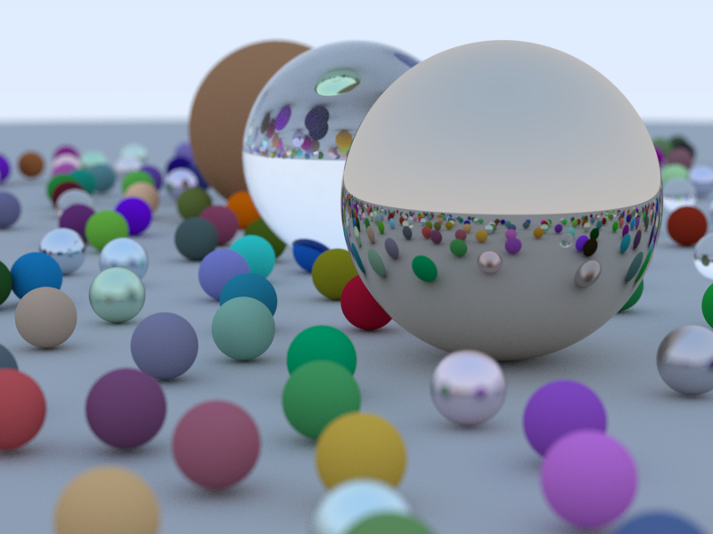

# ChromaPath



A path tracer implementation in Rust inspired by [Ray Tracing in One Weekend](https://raytracing.github.io/books/RayTracingInOneWeekend.html).

## Features

Three rendering backends producing identical results:
- **CPU**: Multi-threaded with SIMD optimization via [glam](https://docs.rs/glam/latest/glam/)
- **GPU Compute**: Vulkan compute shaders via [vulkano](https://github.com/vulkano-rs/vulkano)
- **Hardware RT**: GPU-accelerated ray tracing with [vulkano](https://github.com/vulkano-rs/vulkano) RT extensions

Output formats: PNG and EXR with [TEV viewer](https://github.com/Tom94/tev) support

## Architecture

### GPU Compute Pipeline
The compute shader implementation uses Vulkan's general-purpose compute capabilities:
- Scene data (spheres, materials) uploaded to GPU buffer storage
- Ray generation and path tracing logic implemented in GLSL compute shaders
- Monte Carlo sampling for realistic lighting and materials
- Parallel execution across GPU compute units (one thread per pixel)
- Results accumulated in output image buffer

### Hardware Ray Tracing Pipeline
The hardware RT implementation leverages dedicated RT cores:
- **Acceleration Structures**: Bottom-Level (BLAS) and Top-Level (TLAS) for fast ray-scene intersection
- **RT Shaders**: Ray generation, closest hit, miss, and intersection shaders
- **Shader Binding Table (SBT)**: Links geometry to material shaders
- **Hardware-accelerated traversal**: RT cores handle BVH traversal automatically
- Significant performance gains on modern GPUs (RTX series)

## Performance

*AMD 7900X (24 threads) + RTX 3090, 800×600 resolution, 500 samples per pixel*

| Backend | Time | Speedup | 
|---------|------|---------|
| CPU | 101.79s | 1.0× |
| GPU Compute | 7.53s | 13.5× |
| Hardware RT | 0.66s | **154.9×** |

## Requirements

- Vulkan SDK
- Rust 1.70+
- GPU with ray tracing support (for hardware RT mode)

## Usage

```bash
# CPU rendering
cargo run --release -- -s 100

# GPU compute shaders  
cargo run --release -- --gpu -s 100

# Hardware ray tracing
cargo run --release -- --hardware-rt -s 100

# Benchmark all modes
cargo run --release -- --bench

# Output formats
cargo run --release -- --hardware-rt -s 100 -o output.png
cargo run --release -- --hardware-rt -s 100 -o output.exr

# Send to TEV viewer
cargo run --release -- --hardware-rt -s 100 --tev
```

## Next Steps

- Triangle primitive support
- [glTF 2.0](https://registry.khronos.org/glTF/specs/2.0/glTF-2.0.html) scene loading

## References

- [Ray Tracing in One Weekend](https://raytracing.github.io/books/RayTracingInOneWeekend.html)
- [Physically Based Rendering](https://www.pbr-book.org/4ed/contents)
- [NVIDIA Vulkan Ray Tracing Tutorial](https://nvpro-samples.github.io/vk_raytracing_tutorial_KHR/)
- [TEV - The EXR Viewer](https://github.com/Tom94/tev)
